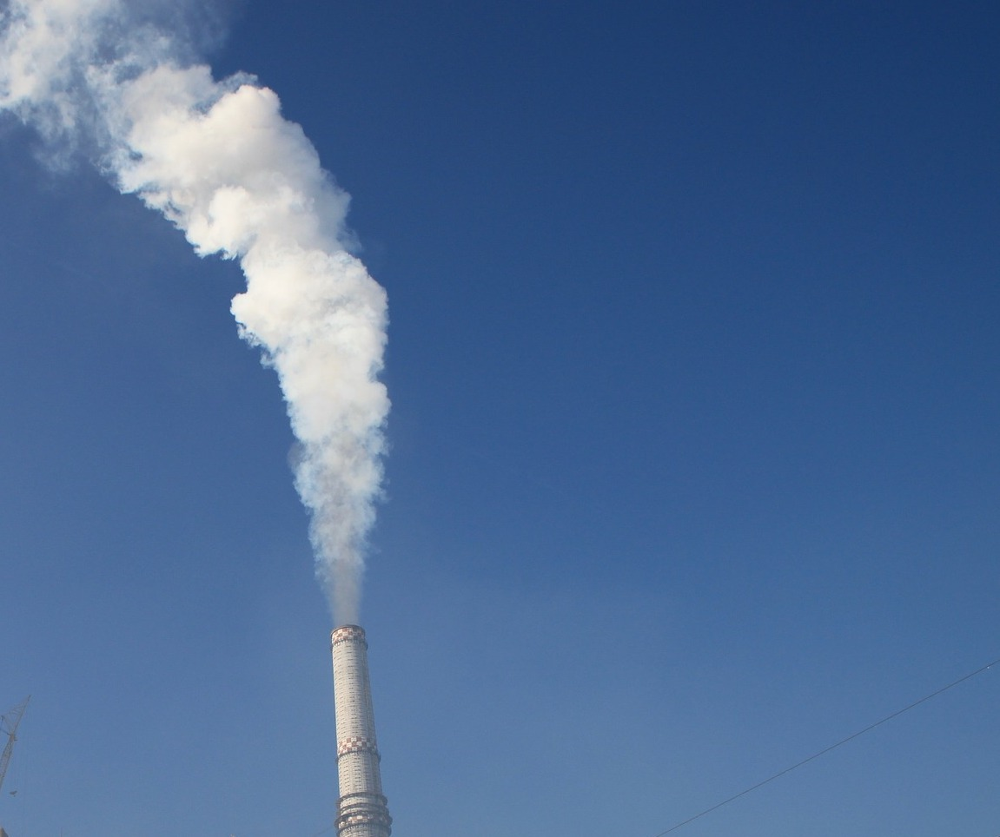

```{r setup, include=FALSE}
knitr::opts_chunk$set(echo = TRUE)
library(dplyr)
library(tidyverse)
library(lubridate)
library(gt)
library(ggplot2)
library(ggrepel)
library(scales)
library(plm)
options(scipen=999)
```

# The end of coal in Britain: How did they get there and who awaits at the end of the coal tunnel?

The Great Britain is daring greatly toward the end of the coal era. Only two years after the government's official commitment to coal phase-out, [Britain's electricity sector reportedly went two months without coal power](https://www.bbc.com/news/science-environment-52973089). As a sustainable energy advocate, I was thrilled about this news. Then I started pondering these questions: 

* What are primary sources of electricity generation in Britain, now that coal is gone? Has its electricity become "greener"?
* What led to the decline of coal? What are some historical trends? 
* Can the growth of renewables pace with the rate of decline of coal? 
* What is the effect of coal phase-out on reducing carbon emissions?

# Data

[Grid Watch](http://gridwatch.templar.co.uk/) provides data on electricity demand and supply in Britain by energy source. I will analyze this dataset to answer these questions. To answer the last question, I will utilize carbon emissions data from [Our World in Data](https://github.com/owid/co2-data).

## Data Cleaning

```{r}
# Load dataset from Grid Watch 
elec_raw <- read.csv("data/gridwatch.csv")

## Extract years from the time data
elec_raw$year <- year(ymd_hms(elec_raw$timestamp))

## Calculate total output of all energy sources. We sum the capacities of pumped, hydro, oil, ocgt sources because they are negligible.
elec_raw <- elec_raw %>% mutate(
  renewable = wind + solar + biomass,
  other = pumped + hydro + oil + ocgt)

## Select variables of interest. We rename "ccgt" variable to "gas" for easy use of terms. We consider wind, solar, biomass as one category (renewable).
elec <- elec_raw %>% select(id, year, coal, nuclear, ccgt, renewable, other) %>% rename(gas=ccgt)

## Check for missing values 
colSums(is.na(elec))

# Load dataset from Our World in Data, select Britain and select variables of interest 
co2_raw <- read.csv("data/owid-co2-data.csv") %>% filter(country=="United Kingdom", year > 1989) %>% select(year, co2, coal_co2, energy_per_capita, population, gdp)

## Check for missing values 
colSums(is.na(co2_raw))

```

## Data Wrangling 

In the Grid Watch dataset, the unit of measurement for electricity output from each source is in MW. In other words, each value represents the total capacity of all power generators by source that was active at one point in time. For the purpose of analysis, we will take the yearly average of the active capacity by source. 

```{r warning=FALSE, message=FALSE}
# Pivot the dataset longer and calculate yearly average by source.
elec_long <- elec %>% pivot_longer(cols=coal:other,
                              names_to="source",
                              values_to="output") %>% filter(year!=2021)
elec_calc <- elec_long %>% 
  group_by(year, source) %>% 
  summarize(output = round(mean(output),2) ) %>% arrange(desc(year)) %>% as.data.frame()
```

The CO2 dataset provided by Our World in Data will be merged with a subset of the Grid Watch data to compare trends in CO2 emissions and coal power generation. 

# What are primary sources of electricity generation in Britain, now that coal is gone? Has its electricity become "greener"?


```{r}
# Calculate the energy mix in 2020 
mix_2020 <- elec_calc %>% filter(year==2020) %>% select(-year) %>%
  mutate(share=round(output/sum(output)*100,2)) %>% arrange(desc(share)) 

# Put the results in a nice table
gt(mix_2020) %>% tab_header(
  title="Britain's Electricity Mix in 2020") %>% tab_source_note(
  source_note = "Source: Grid Watch"
) %>% cols_label(
  source="Energy",
  output="Output (MW)",
  share = "Share in %"
)

```


Gas is the most dominant source of electricity in Britain (`r mix_2020[1,3]`%). Coal power accounted for only `r mix_2020[5,3]`%. Renewables have risen reasonably, accounting for `r mix_2020[2,3]`% of the energy mix. Although the decline of coal should be celebrated, gas should ultimately be replaced with renewable energy sources for the sake of climate. Nuclear power is a subject for a heated debate. Regardless of the heated nuclear politics, (the cost of renewable energy has fallen significantly (88% for utility-scale solar), while that of [nuclear has gone up by 23%](https://www.reuters.com/article/energy-nuclearpower-idAFL5N26F42J). [BBC's 2019 Energy Briefing](https://news.files.bbci.co.uk/include/newsspec/pdfs/bbc-briefing-energy-newsspec-25305-v1.pdf) reports that nuclear power stations are experiencing delays due to similar concerns.


# What led to the decline of coal?  

The decline of coal power in Britain was already underway well before the government's announcement of coal phase-out commitment in 2018. After reaching its peak in 2012, coal started rapidly declining, as the graph below demonstrates. According to [Carbon Brief](https://www.carbonbrief.org/countdown-to-2025-tracking-the-uk-coal-phase-out), 8.4GW of coal power plants have closed since 2010. Closure of the last coal power station in Britain is scheduled in 2025. 

```{r include=FALSE}
# Subset coal data
coal <- elec_calc %>% filter(source=="coal")
# Calculate % change in coal power since 2013, when the carbon tax was imposed.
# Calculate % change in coal production since 2013
coriginal <- coal$output[coal$year==2013]
coal <- coal %>% mutate(change_2011 = round((output-coriginal)/coriginal*100,2))
coal_drop <- coal$change_2011[which(coal$year==2020)]

```

The decline of coal can be attributed to tightened regulations for air pollution control and tackling climate change. Of particular influence was imposing [carbon tax](https://www.ft.com/content/a05d1dd4-dddd-11e9-9743-db5a370481bc) on companies that produce electricity from fossil fuels in 2013. In addition, all new coal power plants were required to be equipped with carbon capture and storage (CCS) system, which is prohibitively expensive. The carbon tax and CCS requirement led to the loss of business case for coal. The graph below shows that coal power generation declined by *`r abs(coal_drop)`*(!!) since 2013, when carbon tax was introduced. 

```{r}
# Graph
ggplot(coal, aes(x=year, y=output)) + geom_area(alpha=0.5) +
  labs(title = "Change in Coal Power Loaded Capacity 2011-2020",
        y="Output in MW") +
    theme_classic() + 
  theme(axis.title.x=element_blank()) + 
  geom_point(alpha=0.4) +
  geom_text_repel(aes(label=output)) +   
  scale_x_continuous(breaks=pretty_breaks()) + 
  geom_vline(xintercept=2013, linetype="dashed", color="red") #Dotted red line shows the year in which carbon tax was introduced. 

```


### 3. How has other sources of electricity flared in comparison to coal? Can the growth of renewables pace with the rate of decline of coal?  
 
General overview of change in electricity output of all data sources shows that the production of electricity from coal has dropped significantly over the years. However, growth of renewable energies  (solar, wind, biomass) is slower than the pace at which coal has declined. Instead, gas has replaced coal, accounting for `r mix_2020[1,3]` % of the energy mix. Meanwhile, nuclear power generation shows slow decline, taking up `r mix_2020[3,3]`% of the energy mix. 


```{r}
# Factorize energy sources for plotting
elec_calc$source <- factor(elec_calc$source, levels=c("coal","renewable", "gas", "nuclear", "other"))

# Plot change in energy output by source 
ggplot(elec_calc, aes(x=year, y=output, fill=source)) +
  geom_area(alpha=0.8) +
  labs(title="Change in loaded generation capacity by source (2011-2021)",
       x="Year", y="Yearly average output (MW)") +
  theme_light() +  ylim(0,40000)

```

# Has the decline of coal power contributed to reducing carbon emissions in Britain?

```{r include=FALSE}
# Calculate the % change in carbon emissions compared to 1990 level
original <- co2_raw$co2[which(co2_raw$year==1990)]
co2_calc <- co2_raw %>% mutate(
  change_1990 = round((co2-original)/original*100,2))
co2_ch_1990 <- co2_calc$co2[which(co2_calc$hhyear==2018)]

```

Compared to 1990, Britain's carbon emissions had dropped by `r abs(co2_ch_1990)`. The red dotted line marks the year 2013, when carbon pricing was introduced to Britain. 


```{r}
# Graph relative change in carbon emissions and coal production by year.
ggplot(co2_calc, aes(x=year, y=change_1990)) +
  geom_line(color="blue", size=1) +
  theme_classic() + 
  labs(y="% Change", title="Change in Carbon Emissions Compared to 1990 in Britain") + 
  theme(plot.title=element_text(hjust=0.5)) + 
  geom_vline(xintercept=2013, color="red", linetype="dashed") 
  
```

It would be great if we could could estimate the effect of coal's decline on carbon emissions through  regression analysis. However, the difference in granularity of the datasets (the power generation data is collected every 5 minutes, whereas the emissions data are collected every year) and missing data  leave us with only 6 data points. Since running a regression on such a small dataset could lead to misleading analysis, I will calculate the correlation coefficient instead.


```{r}
# Merge datasets 
cov_data <- merge(co2_calc, coal) 
cor.test(cov_data$co2, cov_data$output, method="pearson")

```

Coal power generation and carbon emissions are positively associated, with high statistical significance! 


# Conclusion: Goodbye Coal, Hello Renewables!



The coal era has (almost) ended in Britain. Introduction of carbon tax in 2013 was an important factor that accelerated the decline of coal, reducing active coal power capacity by `r abs(coal_drop)`%. However, Britain's electricity has not necessarily become "greener", since gas has replaced the place of coal, taking up `r mix_2020[1,3]`% of the energy mix. This is problematic for the climate agenda. More policy support is necessary to expand renewable capacity, smart grids infrastructure and energy storage systems. Overall, the decline of coal has contributed significantly to Britain's climate agenda.  

_This is my first data analysis project that I share publicly since I started learning data science at the Hertie School of Governance in 2019. It must be fraught with mistakes and analytic errors that I did not catch. Please help me improve my work by sharing your thoughts and ideas, Thank you! 
_
